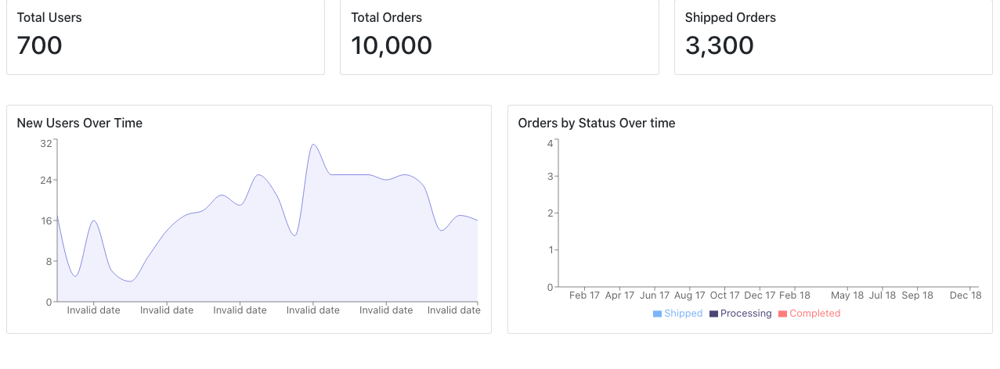

# Proyecto CUBEJS y React

Este es un ejemplo del uso de cube como API y REACT en el front
siguiendo la guia https://cube.dev/blog/cubejs-open-source-dashboard-framework-ultimate-guide/

- Base de datos: *postgresql*
  `ecom.backup`
- Para ejecutar el API de Cube
  - `cd dashboard-api`
  - `npm install`
  - `npm run dev`

Esto lanzará el localhost:400 el dashboard de cube
- Para ejecutar el Front
  - `cd dashboard-frontend`
  - 	`npm install`
  -  `npm start`

esto lanzara en localhost:3000 el proyecto en react

